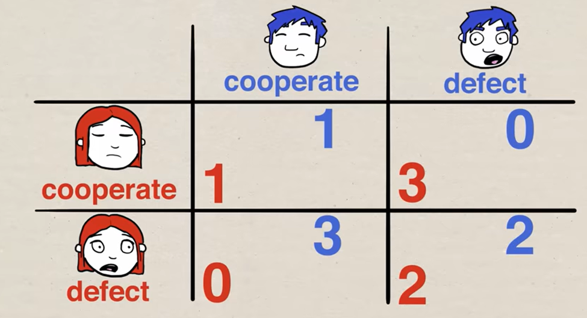

# Prisoner's Dilemma

**Authors**: [Mohammad Doleh](https://github.com/d0leh) and [Yazeed Karajih](https://github.com/ykarajih)

Prisoner's Dilemma is one of the most famous dilemmas where two prisoners are taken into separate rooms, unable to communicate, and each one is given the choice to either stay silent or betray the other prisoner. If both prisoners choose to stay silent, each will go to prison for one year. If one betrays and the other stays silent, the betrayer goes free, and the other prisoner goes to jail for 3 years. If both betray each other, both will go to jail for two years.

## Dilemma Summary

For a better understanding of the dilemma, we recommend watching [this YouTube video](https://youtu.be/t9Lo2fgxWHw?si=ayyzZPm-lHJGWmdM).
This dilemma has real-life applications in politics and business. We became curious about how a reinforcement learning (RL) agent would respond and what it considers the best decision.

We opted for Q-Deep learning, as a Q-Table was not feasible due to 2^10 states.

## Strategies

We started by creating a set of strategies that a player can use when playing against our agent so our agent learns against one of our strategies listed above, not random choices. These strategies we picked are actual strategies that people made in Axelrod’s Tournament, a tournament made by Robert Axelrod in 1980, where he invited well-known game theorists to submit strategies. You can check it out [here](https://cs.stanford.edu/people/eroberts/courses/soco/projects/1998-99/game-theory/axelrod.html).
Our agent learns against these strategies, derived from Axelrod’s Tournament (1980):

- **Tit for Tat**: Cooperates first, then copies the opponent’s last move.
- **Cooperate**: Always cooperate.
- **Random**: Random actions.
- **Tit for Two Tat**: Cooperates unless the opponent defected twice in a row.
- **Grudger**: Cooperates until the opponent defects, then always defects.
- **Pavlov**: Win-stay, lose-switch.
- **Soft Grudger**: Cooperates until defect, defects four times, then returns to cooperation.
- **Fortress**: Defects unless the opponent's last two moves were to cooperate.
- **Sneaky**: Cooperates, then copies the opponent's last move if they cooperated, with a 10% chance of defecting.

## Environment Setup

For the environment, the state is an array of our last 10 moves. The agent has two actions, whether to defect or cooperate (0 or 1). Each game consists of 200 rounds, our agent will try to win as many games as possible so we can then calculate its average win rate to indicate the performance of our model, where each win is a game in which the opponent gets to go to prison for more years than our agent.

Note that we tried to have our state be the opponent’s last 10 moves; however, we found that a state that changes based on the agent's action is more effective.

The step function contains the changes happening in one round. It finds out the opponent's move and calculates the reward as follows: 

| Our Agent | Opponent   | Reward |
|-----------|------------|--------|
| Cooperate | Cooperate  |  3     |
| Cooperate | Cooperate  |  0     |
| Defect    | Cooperate  |  5     |
| Defect    | Defect     |  1     |

Then, it makes the needed changes for the state such that it keeps updating for each round. In the reset function, we complete the needed initializations for a new game.

## Results

Our agent then played with random actions, and we tested the average win rate, which was around 0.4 against our strategies. After that, we built our model and used DQNAgent from Keras, where our agent made it to a 0.9 average win rate and converged after 50,000 iterations. We used BoltzmannQPolicy because it provides a good balance between exploration and exploitation.

## Extra work

We then wrote our own DQNAgent class, utilizing a memory buffer and a high exploration policy in the beginning that decays over time.

Then, we built a simple neural network that learns in mini-batches, tries to predict the next state of best quality based on its past experiences, and chooses its action accordingly.

# Second code, adding a third player!
We expanded our dilemma into adding a third player, so instead of having two prisoners, we now have three prisoners, and each one is being investigated within separate rooms, allowing each decision to make a difference in the other two prisoners' state. In this environment, we had to change the strategies into the following:
- **Tit for tat all**
- **Tit for tat any**
- **Tit for two tat any**
- **Tit for two tat all**
- **Soft grudger any**
- **Soft grudger all**

The state now is a 2d array where each row represents the last 10 moves of one of the opponents. The rewards have changed as follows:
| Our Agent | Opponent 1 | Opponent 2 | Reward |
|-----------|------------|------------|--------|
| Cooperate | Cooperate  | Cooperate  | 4      |
| Cooperate | Cooperate  | Defect     | 0      |
| Defect    | Cooperate  | Cooperate  | 10     |
| Defect    | Defect     | Defect     | 2      |

Our agent’s average win rate against opponents' strategy using random actions was 0.37. Then, after training our model for 25,000 iterations and letting it converge, its average win rate increased to 1.

## Conclusion

In conclusion, our RL agent showed us that the optimal way to play Prisoners Dilemma is to try to catch the opponent off guard by defecting suddenly and then playing defensively to maintain his lead.
